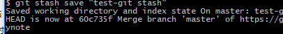
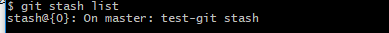
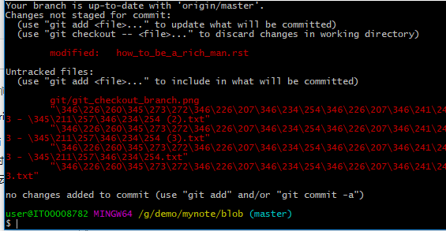
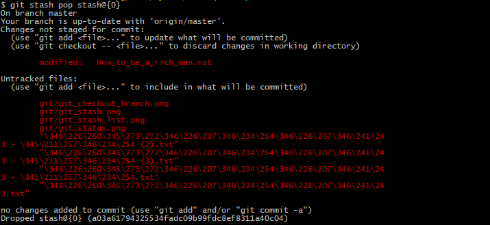

git 笔记
===========
git的概念
------------
git 是一个开源的分布式版本控制系统,原本是为了Linux的爸爸Linus 为了管理Linux内核而开放的一个开源的版本控制系统
无心插柳柳成荫，变成如今一个非常流行的一个版本控制系统，它是一个分布式的，不依赖于服务器的支持

git的工作流程
--------------===========
git 笔记
===========
git的概念
------------
git 是一个开源的分布式版本控制系统,原本是为了Linux的爸爸Linus 为了管理Linux内核而开放的一个开源的版本控制系统
无心插柳柳成荫，变成如今一个非常流行的一个版本控制系统，它是一个分布式的，不依赖于服务器的支持

git的工作流程
--------------
- 克隆git 项目作为工作项目--->git clone
- 在克隆的资料上添加或者修改文件--->vi test.c
- 如果别人在和你同一个项目上进行修改，你可以通过拉取服务器最新代码进行更新--->git pull
- 查看修改--->git status git diff
- 提交修改--->git commit -m ""
- 修改完成后，发现错误，可以撤回提交并重新修改提交 git 

git的工作流
--------------
-- 
	你的本地仓库由git维护的三颗"树"组成
	第一个是你的工作目录(workspace)，位于PC上，它持有实际的文件
	第二个是暂存区（index），它像个缓存区域，临时保存你的改动
	第三个是HEAD，它指向你最后一次提交的结果
	
git的简单命令
--------------
-- 
	如果在工作过程中，想要对某个问题进行追踪，又不想影响到主分支的行为
	那么可以新建分支并在对应分支上进行修改
	修改后进行测试，确保修改是正确的，那么可以将其合并到你的master分支来部署在线上
	
- 新建分支: git checkout -b test
	相当于git branch test + git checkout test

- 合并分支: git merge 
	git checkout master git merge test

- 删除分支: git branch -d
	git branch -d test

--
	有时候,当你的项目的一部分上已经工作一段时间，看起来所有东西都很混乱。
	这个时候突然接到一个任务，想要在以前代码的基础上进行功能开发
	但是你代码已经写了一部分，没必要把现在的进度commit或者reset掉从头开始
	问题的答案在于:git stash命令
	stash命令会处理掉当前工作任务的脏的状态：把你现在修改的跟踪文件和暂存
	并且将所有的修改都保存在栈上，这个时候可以开始你的表演了

- 储藏: git stash
	将当前所有的修改都进行压栈处理

- 释放: git pop
	将压栈的数据进行弹栈
